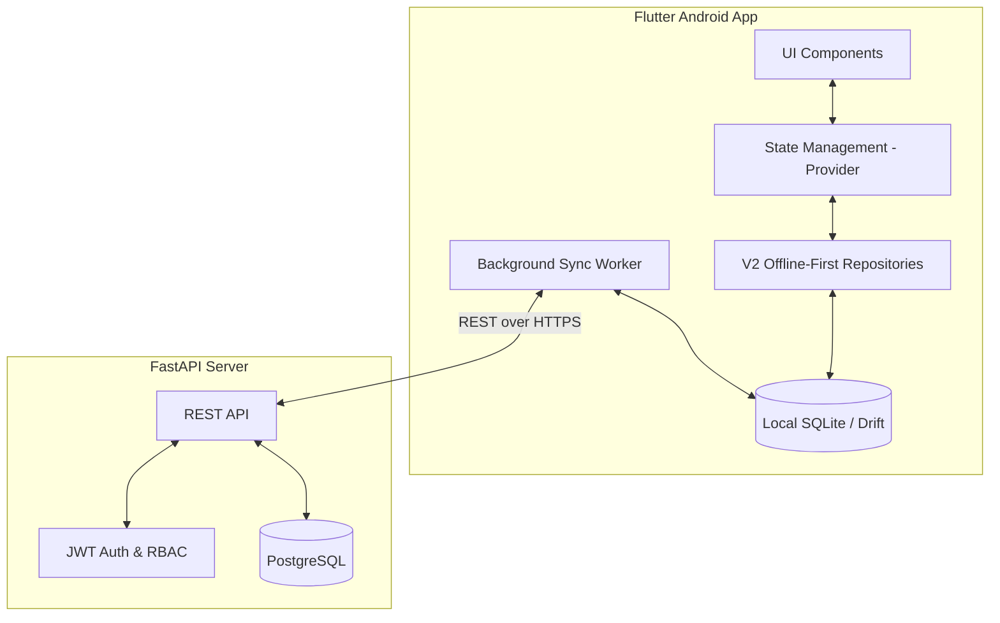

# POS & Inventory System Architecture

The POS & Inventory system is built as an offline-first Flutter application backed by a FastAPI/PostgreSQL server. It is designed to work reliably in environments with intermittent internet connectivity.

## Offline-First Approach

The mobile app relies **entirely** on the local SQLite database (managed via Drift) for all reads and writes. 
*(Note: Many components are suffixed with `_v2` (e.g., `product_repository_v2.dart`). This "V2" architecture is the canonical, production architecture. The suffixes remain to distinguish offline-first components from legacy cloud-only prototypes.)*

### Roles & Responsibilities
- **Cashier**: Can process sales, view inventory, and access the POS. Needs no internet connection once logged in.
- **Admin**: Manages store operations, inventory, and cashiers for a specific store.
- **Superadmin**: Full system access across all stores.

### Data Sync Strategy
1. **Local Writes**: When a cashier processes a sale, it is immediately written to Drift. The UI updates instantly.
2. **Background Sync**: A Workmanager background task periodically pushes new records to the FastAPI backend and pulls updates.
3. **Conflict Resolution**: The app uses `clientId` (UUID) and `serverId` (Integer) to manage records across devices. The `syncStatus` column tracks the state of each record (`pending`, `synced`, `conflict`, `error`).
4. **Indestructible Identity**: Offline logins are supported for previously authenticated users by hashing passwords locally.
